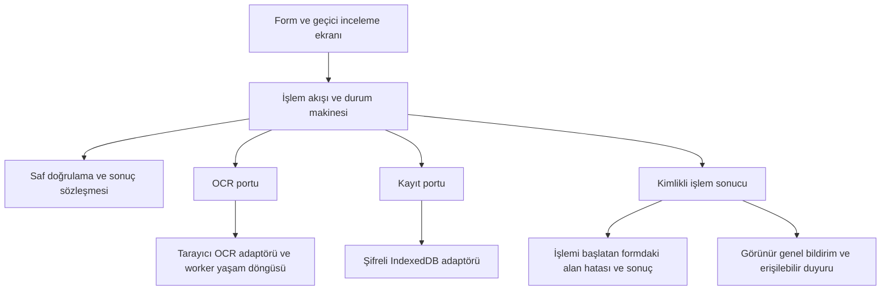

# Kart fotoğrafı okuma ve işlem bildirimleri — araştırma raporu

> Bu belge 1.4.0 araştırmasının tarihsel kaydıdır. Üç aşama uygulandı; güncel kapanış ve ölçüm:
> [1.5.0 uygulama sonucu](OCR_VE_BILDIRIM_UYGULAMA_SONUCU.md).

**Tarih:** 3 Ekim 2026. **İncelenen sürüm:** 1.4.0, `9d18259fb4a66b3a3eff3a111b6a19c24332e1fe`.
**Durum:** araştırma ve üç aşamalı çözüm tasarımı; aşağıdaki düzeltmeler henüz uygulanmadı.

## Kullanıcı için sonuç

Fotoğraftan okuma ve mesaj görünürlüğüyle ilgili şikâyetler doğrulandı. Bazı hatalarda uygulama
mesaj üretiyor, ancak mesaj kart penceresinin arkasında veya ekranın dışında kalıyor. Bazı ayar ve
yedek işlemlerinde ise gerçekten hiçbir hata mesajı üretilmiyor. Bunlar birbirinden farklı sorunlar.

Fotoğraf okuma düz ve temiz örneklerde çalışıyor; döndürülmüş görüntülerde ve numaranın farklı
satırlara bölündüğü örneklerde başarısız oluyor. Okuma dosyası yüklenemezse neden açıklanmadan
uzun süre bekleniyor. Yeni fotoğraf kısmen okununca önceki alanlarla yeni alanlar karışabiliyor.

**20 bulgu kaydedildi:** 8 okuma/okuma arayüzü bulgusu, 9 işlem bildirimi bulgusu,
3 mimari ve test kapsamı eksikliği. Bunların tamamı 20 ayrı veri kaybı olayı anlamına gelmez.
Kanıt türü her bulguda ayrıdır. Hiçbir “tüm fotoğraflar artık okunur” veya “tam güvenlik” iddiası yoktur.

Mevcut saf kurallar, atomik şifreli depo ve katman ayrımı korunabilir. Gerekli çalışma, işlemlerin
sonuç sözleşmesini ve kullanıcıya nasıl gösterildiğini sağlamlaştırmak; okuma hattını ölçülebilir
hâle getirmektir. Büyük bir framework veya programı baştan yazmak gerekmiyor.

## Kapsam, yöntem ve sınırlar

- Kart numarası/tarih okuma; cari/kart kayıt, düzenleme ve silme; yedek, geri yükleme, iptal ve hata.
- Ayarlar, geçmiş/yedekler, depo kontrol kayıt bildirimleri ve Drive ekranlarının kod taraması.
- Linux/Chromium, masaüstü 1440 × 800 ve dar görünüm 390 × 800; gerçek Web Crypto ve IndexedDB.
- Üretim derlemesi `vite preview` üzerinde arayüz denemeleri; saf çıkarıcı ve OCR adaptörü Vite
  geliştirme sunucusunda ayrıca doğrudan çalıştırıldı. Doğrudan adaptör denemeleri üretim UI testi değildir.
- 15 yapay fotoğraf, 8 saf metin senaryosu, 8 temel arayüz gözlemi, 2 ek senaryo ve 2 worker arıza senaryosu.
  Bazı senaryolar birden fazla bulguya kanıt sağlar; bu sayı kalıcı test sayısıyla karıştırılmamalıdır.
- Model dosyasına yapay 404 ve bitmeyen yanıt; engelli yerel kayıt; eksik yedek içeriğiyle hata enjeksiyonu.
- Kullanıcının gönderdiği ekran görüntüsünde boş okuma sonucu görüldü. Görüntüdeki gerçek cari
  bilgileri rapora/teste aktarılmadı. Gerçek kart fotoğrafı bu araştırmada işlenmedi veya dışarı gönderilmedi.
- Windows Chrome/Edge, gerçek Google OAuth/Drive işlemi, gerçek POS/ödeme ve gerçek fotoğrafın kesin
  kök nedeni bu denemelerle doğrulanmış değildir. Görüntüden tek başına eğiklik/kontrast sonucu çıkarılamaz.

Kanıt türleri: **T** tarayıcıda tekrarlandı; **M** saf metin/çıkarıcı denemesi; **K** kaynak kodunda
mevcut sınır/eksiklik; **G** kullanıcının ekran görüntüsündeki gözlem. Öncelik **P1** ilk giderilecek,
**P2** güvenilirlik ve kullanım iyileştirmesi. Bu araştırmada P0 düzeyinde bir olay doğrulanmadı.

Ayrıntılı deney kayıtları: [kanıt eki](OCR_VE_BILDIRIM_KANITLARI.md).

## Bulguların dökümü

### O-01 — Görüntünün yönü ve eğikliği düzeltilmiyor · P1 · T/K

**Kanıt:** aynı yapay kartın 90°, 180° ve 270° döndürülmüş sürümleri numara/tarih vermedi.
12° eğimde tarih bulundu, numara bulunamadı; düz PNG/JPG/WebP sürümleri çalıştı.
**Neden:** `platform/posKartOkuma.ts` yalnızca uzun kenarı küçültüp canvas’a çiziyor; kart alanını
bulma, yön seçimi, eğiklik düzeltme veya uygun bölge üzerinden yeniden okuma yok.
**Çözüm:** geçici önizleme, kullanıcıya döndürme/kırpma ve sınırlandırılmış yön/bölge denemeleri.
**Kabul:** aynı referans kartın düz ve döndürülmüş okunabilir örnekleri doğru alanları verir;
okunamayan fotoğrafta açıklama ve elle devam seçeneği bulunur. Aşama 2.

### O-02 — Numara/tarih çıkarıcısı satır düzenine çok bağlı · P1 · M/T/K

**Kanıt:** numara iki satıra bölününce bulunmadı. Numara ile `12/35` aynı satırda olduğunda numara
bulunmadı. `1/35` veya `1235` gibi tarih yazımı da çıkarılmadı; bunlar ayrı metin deneyleridir.
**Neden:** `cekirdek/posKartFotografi.ts` her satırı ayrı işler; sayı regex’i yanındaki tarih
rakamlarını da numaraya katabilir. Luhn başarısızlığında aday sessizce elenir.
**Çözüm:** satır/bölge sınırlarını koruyan aday üretimi; tarih ve numarayı ayrı bölgelerden çıkarma.
Ayraçsız veya belirsiz metin kesin tarih diye yorumlanmaz; kullanıcıya aday/düzeltme sunulur.
**Kabul:** satır bölünmesi ve aynı satırda tarih için regresyon testleri; başka sayıları yapıştırarak
sahte numara üretmeme. Aşama 2.

### O-03 — Birden fazla tarih bulunduğunda tarihler gösterilmiyor · P2 · T/K

**Kanıt:** iki tarihli yapay fotoğrafta “Birden fazla tarih bulundu” yazdı; bulunan tarihlerin kendisi
seçilebilir biçimde gösterilmedi. Eski ay/yıl alanı olduğu gibi kaldı.
**Neden:** `KartFormu.tsx` tarih adaylarını yıl seçeneklerine ekliyor, fakat aday çiftlerini sunmuyor.
Numara adayları yalnızca son dört rakamla gösteriliyor; son dört rakamı aynı adaylar da ayrışmayabilir
(bu son durum kaynak kodu incelemesidir, ayrı tarayıcı denemesi yapılmadı).
**Çözüm:** geçici görüntüde konumuyla ilişkili maskeli numara ve ay/yıl aday seçimi; belirsizlik açıklaması.
**Kabul:** iki tarih açıkça seçilebilir, kullanıcı seçmeden tarih kesinleştirilmez. Aşama 2.

### O-04 — Yeni fotoğraf eski alanlarla birleşebiliyor · P1 · T/K

**Kanıt:** eski kart düzenlenirken boş fotoğraf okutuldu; eski numara/ay/yıl kaldı. Başka denemede
fotoğraftan yeni numara geldi, çoklu tarih yüzünden eski ay/yıl korundu: farklı kaynaklardan birleşik kart.
**Neden:** `KartFormu.tsx:76` yalnızca tek aday bulunan alanları değiştiriyor; alanın hangi
fotoğraftan/elle girişten geldiği izlenmiyor. Yeni okuma eski fotoğraftan türetilmiş alanları geçersiz kılmıyor.
**Koruyan davranış:** kontrol kutusu sıfırlanıyor; otomatik kayıt yok. Bu denemede yanlış kart kaydedilmedi.
**Çözüm:** OCR sonucunu önce ayrı inceleme taslağında tutmak; kullanıcı hangi alanları uygulayacağını
seçmek; korunacak elle girilmiş alanları ve yeni fotoğraf alanlarını açıkça ayırmak.
**Kabul:** ikinci fotoğraf, boş/kısmi/çoklu sonuç ve düzenleme testlerinde sessiz alan karışımı yok. Aşama 2.

### O-05 — Model yükleme arızası ve erken iptal worker’ı açık bırakıyor · P1 · T/K

**Kanıt:** model dosyası 404 olduğunda arayüz %0’da kaldı. 90 saniyelik zaman aşımı yapay saatle
ilerletildiğinde “okuma durduruldu” mesajı geldi; Worker oluşturulmuştu ama sonlandırılmamıştı.
Bitmeyen model isteğini iptalde de aynı kaynak yaşam döngüsü sorunu görüldü; aktif worker sayısı ekte.
**Neden:** `worker = await createWorker(...)` ataması ancak kurulum tamamlanınca gerçekleşiyor.
Kurulum tamamlanmazsa temizlik kodunun elinde worker yok. Tesseract.js 7.0.0’ın
`src/createWorker.js:239` zinciri dil/başlatma reddini yutuyor; dış başlangıç promise’i bekleyebiliyor.
**Çözüm:** kurulum sırasında da yönetilebilen, zaman aşımı/iptalde sonlandırılabilen OCR adaptörü.
Sürüm değiştirmek tek başına çözüm kabul edilmez; arıza testiyle doğrulanmış yaşam döngüsü gerekir.
**Kabul:** 404, ağ beklemesi, kurulumda iptal ve tekrar başlatmada aktif worker/kuyruk işi sıfıra iner;
geç sonuç kabul edilmez. CPU/bellek miktarı bu araştırmada ölçülmedi. Aşama 1.

### O-06 — İlerleme ve iptal/hata durumları birbirine karışıyor · P2 · T/K

**Kanıt:** model yükleme arızası “%0 okunuyor” gösterdi; zaman aşımı kullanıcı iptali gibi anlatıldı.
“Okumayı durdur” sonrası terminal bir durum mesajı yok; sadece okuma göstergesi kayboluyor.
**Neden:** logger yalnızca `recognizing text` olayını gösteriyor; indirme/başlatma evreleri yok.
Manuel iptal ve süre dolması aynı hata; form `signal.aborted` durumunda mesajı bastırıyor.
**Çözüm:** “dosya denetleniyor / okuma aracı hazırlanıyor / okunuyor / inceleme / bulunamadı /
iptal / süre doldu / araç yüklenemedi” durumları; indirme yüzdesi bilinmiyorsa sahte yüzde vermemek.
**Kabul:** her işlem tanımlı terminal duruma ulaşır; neden ve sonraki adım açıklanır. Aşama 1.

### O-07 — Boş/kısmi sonucun nedeni ve kalite bilgisi kayboluyor · P2 · K/G

**Kanıt:** sonuç türü yalnızca `numaralar/tarihler`; `data.confidence` kullanılmıyor,
bölge çıktısı istenmiyor. Luhn’dan elenen aday ile hiç rakam bulunmaması aynı boş sonuca dönüşüyor.
Kullanıcı ekran görüntüsünde bunun genel “okunamadı” karşılığı görülüyor.
**Neden:** tanıma, aday çıkarma ve formu doldurma arasında açıklanabilir bir sonuç sözleşmesi yok.
**Çözüm:** güven/konum/elenme nedeni gibi yalnızca geçici okuma metaverisi ve alan bazında sonuç.
Güven puanı veya Luhn doğru kart sahibinin kanıtı olarak sunulmaz; rakamları tahmin ederek düzeltme yapılmaz.
**Kabul:** numara eksik, tarih eksik, kontrolü geçmeyen aday ve çoklu aday ayrı açıklanır. Aşama 2.

### O-08 — Seçilen fotoğrafın durumunu kullanıcı takip edemiyor · P2 · K/G

**Kanıt:** dosya girişinin değeri seçimde temizleniyor; kullanıcı görüntüsünde işleme sonrası
“No file chosen” görünüyor. Görüntü önizlemesi, döndürme/kırpma veya okunan alanla görsel karşılaştırma yok.
**Neden:** fotoğrafı kalıcı saklamama tercihi doğru; ancak bunun yerine geçici işlem durumu sunulmamış.
Dosya seçici dili tarayıcıya ait olduğundan arayüz diliyle de farklılaşabiliyor.
**Çözüm:** Türkçe seçim düğmesi, “fotoğraf işlendi/iptal edildi” bilgisi ve bellekte geçici önizleme.
**Kabul:** kullanıcı hangi okumanın sonuçlandığını görür; form kapanınca dosya/görüntü temizlenir,
fotoğraf veya gerçek dosya adı günlüğe/yayına girmez. Aşama 2.

### B-01 — Kayıt hatası kart penceresinin arkasında kalıyor · P1 · T/K

**Kanıt:** aynı numarayı ikinci kart olarak kaydetme hatası sayfa üstünde çıktı; açık dialog içinde
hata sayısı 0’dı. Ekran görüntüsünde hata satırının önemli kısmını pencere kapatıyor.
**Neden:** `usePosProfili.calistir` hata metnini üst sayfaya yazıp yalnızca `false` döndürüyor.
`KartFormu` bunu yerel hata olarak göstermiyor. Üst hata kutusuna odak verme dialog dışında kalıyor.
**Çözüm:** işlem sonucu hatayı işlemi başlatan forma taşır; dialog içinde özet ve ilgili alan gösterilir.
**Kabul:** yinelenen kart, dolu/engelli depo ve kayıt çakışması mesajı dialog içinde okunur. Aşama 1.

### B-02 — Yerel hata üretilse bile odak ve kaydırma eksik · P1 · T/K

**Kanıt:** kontrol kutusu hatası dialog üstten görünürken ekran yüksekliği 800 px içinde
`y ≈ 833` konumunda kaldı. Odak hata özetine veya alana taşınmadı.
**Neden:** formun altındaki `role=alert` görsel yerleşim/fokus sağlamıyor; alanlarda hatayla
ilişkili `aria-invalid` ve hata açıklaması bağlantısı yok. Enter ile gönderim ayrıca test edilmelidir.
**Çözüm:** görünür form hata özeti, alan hatası, kapsayıcı içinde kaydırma; uygun odak yönetimi.
**Kabul:** tıklama ve Enter’da ilk hatalı alan/özet görünür ve klavyeyle erişilir. Aşama 1.

### B-03 — Başarı mesajı dar ekranda görünür alanın dışında · P1 · T/K

**Kanıt:** 390 × 800 görünümde kart kaydından sonra başarı kutusu `y ≈ -190`, alt kenarı `-146`;
mesaj DOM’da mevcut ama kullanıcı o anda kart listesini görüyor. Bu olay “mesaj hiç yok” gibi algılanır.
**Neden:** başarı yalnızca sayfa üstündeki `oturum.bilgi`; odak/yerel durum/ görünür sabit bildirim yok.
**Çözüm:** işlem alanında sonuç; gerekirse erişilebilir, görünür genel bildirim. Başarı odağı çalmaz.
**Kabul:** kart/cari/yedek/kopyalama sonucu kullanıcı mevcut konumundayken anlaşılır. Aşama 1.

### B-04 — Geçersiz ayar sessizce eski değerine dönüyor · P1 · T/K

**Kanıt:** tolerans alanına geçersiz metin yazıp ayrılınca eski değer geri geldi; hata sayısı 0.
**Neden:** `AyarlarSayfasi.tsx` girdi bileşenleri `onBlur` içinde geri yazıyor, gerekçe bildirmiyor.
**Çözüm:** geçici girdi taslağı + alan doğrulaması; son geçerli değer korunur ama ret nedeni açıklanır.
**Kabul:** geçersiz sayı, satır, sütun çakışması ve boş tanım açık alan hatası verir. Aşama 1.

### B-05 — Ayar saklanamadığı hâlde kaydedilmiş gibi kullanılıyor · P1 · T/K

**Kanıt:** `localStorage.setItem` engellendi; tolerans ekranda değişti, yenileyince eski değere döndü;
hiç hata mesajı yoktu. Aynı saklama işlevi tema ve Drive istemci kimliği için de kullanılıyor.
**Neden:** `platform/saklama.ts.yaz` hatayı yutuyor ve `void` dönüyor; UI kalıcılık sonucu alamıyor.
**Çözüm:** kalıcı kayıt/yalnızca oturumda uygulama/başarısızlık ayrımı; isteğe bağlı oturum devamı açık anlatılır.
**Kabul:** engelli/dolu depoda “bu oturumda geçerli, kalıcı kaydedilemedi” mesajı; yenileme sonucu testli. Aşama 1.

### B-06 — Geçmiş/yedek okuma hatası boş liste sayılıyor · P1 · T/K

**Kanıt:** IndexedDB açılışı engellendiğinde “Henüz kayıt yok” ve “Henüz yedek yok” çıktı; hata yoktu.
**Neden:** toleranslı `idb.oku` ve `gecmisListesi/yedekListesi` eksik kayıt ile okuma hatasını ayırmıyor.
Sanal POS’un kesin okuma denetimi burada kullanılmıyor.
**Çözüm:** bu ekranlarda yükleniyor/boş/okunamadı/veri hazır ayrımı ve yeniden deneme.
**Kabul:** gerçek boş liste ile depo engeli farklı görünür; hata veriyi silmez. Aşama 1.

### B-07 — İçeriği bulunamayan yedeğin “İndir” düğmesi sessiz · P1 · T/K

**Kanıt:** listede yapay yedek bulundu, byte kaydı eksikti; tıklayınca 0 indirme ve 0 hata oluştu.
**Neden:** `GecmisSayfasi.yedekIndir` ve `KayitBolumu.SonucKarti` yalnızca `if (bayt)` ile devam ediyor.
**Çözüm:** yok/kayıp/okunamadı ayrı sonuç; listeden kendiliğinden silmeden anlaşılır açıklama.
**Kabul:** eksik yedek içeriği ve okuma reddi görünür hata verir; geçerli yedek indirme korunur. Aşama 1.

### B-08 — İndirme isteği kesin indirme başarısı gibi anlatılıyor · P2 · K

**Kanıt:** `platform/dosya.ts.indir` Blob bağlantısına tıklayıp `void` dönüyor; sonuç metinleri
“indirildi” diyebiliyor. Tarayıcının diske kaydettiği sonucu bu yöntem doğrulamıyor.
**Sınır:** kullanıcının bilgisayarında engellenmiş bir indirme olayı bu araştırmada doğrulanmadı;
bu bulgu mevcut geri bildirim sözleşmesinin kanıt sınırıdır.
**Çözüm:** “dosya hazır, indirme başlatıldı”; doğrudan dosyaya yazmada aktarım tamamlanınca “kaydedildi”.
**Kabul:** hazırlandı/başlatıldı/kalıcı yazıldı birbirinden ayrılır; kullanıcı tekrar ödeme/kayıt yönlendirmesi almaz. Aşama 1.

### B-09 — Yedek hatalarında eski kasa/parola dili kalmış · P2 · T/K

**Kanıt:** boş taşınabilir yedek parolasında “Kasa parolasını yazın” çıktı. Günlük PIN kaldırılmış
olduğu için bu metin kullanıcıyı farklı bir şifre beklemeye yöneltebilir.
**Neden:** yedek ve eski kasa aynı parola doğrulama hata metinlerini paylaşıyor.
**Çözüm:** doğrulama kuralı ortak kalır; eski kasa, taşınabilir yedek ve tekrar alanının mesaj bağlamı ayrılır.
**Kabul:** yedek ekranında eski günlük kasa oluşturma dili yok. Aşama 1.

### A-01 — İşlem sonucu metin/boolean üzerinden dağınık taşınıyor · P1 · K

`KullaniciHatasi` yalnızca mesaj taşır; işlem yardımcıları çoğunlukla boolean/void döner.
Hangi işlem/alan, doğrulama mı kayıt mı, iptal mi belirsiz sonuç mu bilgisi ortak sözleşmede yok.
B-01/B-03/B-05’in ortak mimari nedenidir; ayrı bir kullanıcı arızası sayılmamalıdır.
**Çözüm:** kimlikli ve kapsamlı sonuç türü; `başarılı / doğrulama hatası / başarısız / iptal / sonucu belirsiz`.
Kalıcı yazının sonucu belirsizse otomatik tekrar yerine yeniden oku. Aşama 1.

### A-02 — Asenkron yaşam döngüsü uygulama genelinde eşit korunmuyor · P2 · K

POS’ta nesil/bağlılık denetimleri var; Drive bileşenlerinde benzer koruma ortak değil.
Yedek inceleme ayrı yerel kilitle yürür; genel işlem durdurma akışının parçası değildir.
Uygulama kökünde beklenmeyen render hatası için kullanıcıya dönüş sunan Error Boundary yok.
**Kanıt sınırı:** bu üç alan kodda tarandı; bu araştırmada gerçek Drive geç-sonuç veya render çökmesi
olayı yeniden üretilmedi. Risk, doğrulanmış OCR worker arızasıyla karıştırılmamalıdır.
**Çözüm:** ortak işlem kapsamı/nesil denetimi, iptal ve kapanış sözleşmesi; uygun hata sınırı.
Aşama 1’de sözleşme; Aşama 3’te bütün ekranlara uyarlama ve arıza testleri.

### A-03 — Mevcut testler şikâyet edilen durumları yeterince ölçmüyor · P1 · K/T

Mevcut 325 test ve 8 tarayıcı senaryosu yeniden geçti; buna rağmen yukarıdaki hatalar tekrarlandı.
OCR testi düz, yüksek kontrastlı tek sentetik resim. Mesaj testindeki `toBeVisible` metnin ekran
içinde ve pencere tarafından örtülmeden okunmasını kanıtlamıyor. Worker iptal testi başlangıçta
hiç sonuçlanmayan kurulumu ve aktif worker’ın sıfırlanmasını denetlemiyor.
**Çözüm:** doğruluk matrisi, görünür alan/örtülme/odak testleri ve arıza enjeksiyonu.
Aşama 1–2’de her düzeltmenin regresyon testi; Aşama 3’te ortak yayın kapısı.

## Mevcut temelden korunacak parçalar

- `cekirdek/` saf doğrulama ve cari/kart ilişkisi; React/platform bağımlılığı eklenmez.
- Numara Luhn, alan sınırları, cari kimliği ve şema doğrulaması; OCR bu kontrolleri atlamaz.
- AES-GCM, atomik IndexedDB yazıları, revizyon çakışma kontrolü ve eski kasa/yedek geçişi.
- Otomatik ödeme yok; fotoğraf/ham OCR/CVV/OTP kalıcı saklanmıyor. Tam numara günlüğe girmez.
- Günlük PIN’siz tercih korunur. Aynı tarayıcıya erişen kişinin kaydı açabilmesi mevcut sınırdır;
  bildirim/OCR düzeltmesi bunu kullanıcı kimlik doğrulamasına dönüştürmez.
- Sorun tespiti yetkisiz müşteri hesabına giriş/ödeme veya gerçek Google hesabını taklit etmeyi gerektirmez.

## Hedef mimari

- `cekirdek/islemSonucu.ts`: mesaj kodu, alan hataları ve kesinlik durumu; saf veri sözleşmesi.
- `sanalPos/oturum.ts` ve `islemler.ts`: reducer/durum geçişleri ve enjekte edilen portlar;
  tarayıcı ve React bilgisi yok. Mevcut rapor akışındaki saf durum modeli örnek alınır.
- `platform/ocr/`: görüntü denetimi, geçici dönüşüm, motor adaptörü ve sonlandırma; her biri küçük dosya.
- `arayuz/bilesenler/bildirim/`: form kapsamı, sayfa kapsamı, ekran içi gösterim ve erişilebilirlik.
  Modal hata body’deki genel toast’a bırakılmaz; açık dialog kendi hata bölgesinin sahibidir.
- Her işlemde işlem kimliği + kapsam + nesil: eski kart/cari/rota için sonuç yeni ekrana uygulanmaz.
  UI yalnızca kullanıcı eylemi başlatır; sonucu metinden tahmin etmez.
- Okuma sonucu önce inceleme taslağıdır; kaydedilmiş karttan ayrı tutulur. Fotoğraf seçimi alanları
  kendiliğinden kaydetmez. Elle girilmiş alanlar izinsiz silinmez veya başka fotoğrafla sessiz birleşmez.
- Tanısal bilgi gerekirse yalnızca yerel ve sınırlı: hata kodu, evre, süre. PAN, CVV, telefon, cari adı,
  fotoğraf, dosya adı, ham OCR veya bunların hash’leri log/telemetriye alınmaz. Harici analitik eklenmez.
- Sıfırdan framework, genel event bus veya mikroservis gerekmez. Katman yönü ve ~400 satır kuralı korunur.

## Üç aşamalı uygulama ve çıkış ölçütleri

### Aşama 1 — Görünür sonuçlar ve güvenilir işlem yaşam döngüsü

**Sahip olduğu bulgular:** B-01–B-09, O-05–O-06, A-01; A-02 sözleşmesi ve A-03 regresyon altyapısı.

1. Ortak sonuç türü ve işlem kapsamı; metin/boolean yerine alan/kesinlik/iptal taşıyan dönüşler.
2. Dialog içinde hata özeti/alan hatası; sayfa kaydırılsa da görünür başarı; klavye ve ekran okuyucu.
3. Ayar/geçmiş/yedek için boş ile hata ayrımı, kayıt kalıcılığı sonucu, bağlama uygun parola metinleri.
4. OCR kurulum/iptal/zaman aşımı yönetimi; arızada worker/kaynak temizliği ve ayrı durum mesajları.
5. İndirme isteği ve kalıcı kayıt ifadelerinin ayrılması; belirsiz sonuçta güvenli yeniden okuma.

**Çıkış:** yinelenen kart/depo reddi dialog içinde; yerel hata görünür/odaklı; başarı dar görünümde;
engelli ayarda kalıcılık uyarısı; eksik yedekte açık hata; 404/kurulum iptalinden sonra aktif worker 0.
Başarı/başarısızlık, kalıcı depo sonucu doğrulanmadan ilan edilmez. Normal kayıt ve eski kasadan geçiş korunur.

### Aşama 2 — Fotoğraftan okumayı ölçülebilir ve denetlenebilir yapmak

**Sahip olduğu bulgular:** O-01–O-04, O-07–O-08; A-03 OCR matrisi.

1. Fotoğraf önizleme/kırpma/yön seçimi; 10 MiB/20 MP sınırları dönüşümden önce/sonra korunur.
2. Kalite/bölge analizi; seçilmiş küçük sayıda okuma denemesi. Deneme sayısı, eşzamanlı worker,
   toplam süre ve piksel bütçesi sabittir; sınırsız “daha iyi sonuç ara” döngüsü kurulmaz.
3. Geçici konum/güven bilgisiyle aday çıkarımı; numara/tarih bölgesi ayrımı ve katı son doğrulama.
4. Eksik/çoklu/düşük güvenli alan incelemesi; alanların kaynağı ve uygulanması açık kullanıcı seçimi.
5. Yeni fotoğraf, ikinci okuma, iptal ve elle düzenlemede eski taslağın uygulanmasını önleyen nesil kontrolü.

**Çıkış:** 15 örneklik başlangıç matrisi ve genişletilmiş referans küme tekrar ölçülür. Okunabilir
referanslarda beklenen numara/tarih birebir karşılaştırılır; bozuk/belirsiz görüntüde tahminle doldurma
yerine inceleme veya elle devam vardır. Çoklu tarih seçilebilir; eski/yeni fotoğraf alanları sessiz karışmaz.
Tek bir başarı yüzdesiyle genelleme yapılmaz; tam doğru/kısmi/boş/yanlış sonuç ayrı raporlanır.

### Aşama 3 — Uygulama genelinde doğrulama ve sürdürülebilir yayın

**Sahip olduğu bulgular:** A-02 bütün ekranlar, A-03 yayın kapısı; önceki aşamaların entegrasyonu.

1. Cari/kart/yedek, ayarlar, geçmiş, depo kontrol ve Drive akışlarını ortak sonuç sözleşmesine bağla.
2. Her kullanıcı eylemi için sonuç kapsama matrisi: başarısı, doğrulama hatası, depo/ağ hatası,
   iptal, süre dolması, sonuç belirsizliği, rota değişimi ve yinelenen tıklama.
3. Görünür alan, açık modal, odak, erişilebilir açıklama ve koyu/açık/dar görünüm regresyonları.
4. Model/worker/WASM eksikliği; yavaş ağ; farklı fotoğraf boyutu; çoklu sekme; geçmiş/yedek hasarı;
   eski kasa geçişi ve şifreli yedek geri yükleme için sürekli testler.
5. İlgili Chrome/Edge/Windows kullanıcı denemesi ve yerel gizli fotoğraf kabulü; sonuçlar kayıtta
   kişisel/kart verisi içermeden tutulur. Gerçek bankacılık işlemi başarı testi diye sunulmaz.

**Çıkış:** `npm run kontrol` + tarayıcı regresyonları + OCR doğruluk matrisi; yayın varlıklarında
worker/model/WASM erişimi; açık P1 kalmaması. A-02’nin yalnızca kodda görülen riskleri arıza testleriyle
kapatılır. Kullanıcıya sürüm, giderilen sorunlar ve bilinen sınırlar açıkça anlatılır.

**Sıra gerekçesi:** önce sonucu güvenilir biçimde görmeliyiz; sonra okuma doğruluğunu artırmalıyız;
son olarak bütün akışları ortak denetim altında tutmalıyız. İkinci aşama birinci aşamanın sonucuna
bağlıdır. Üçüncü aşama testleri ilk iki aşamadaki regresyon testlerinin yerine geçmez.

## Tamamlandı demek için kontrol listesi

- Başlatılan işlem ya tanımlı sonuca ulaşır ya görünür biçimde sürer; sessiz başarısızlık yok.
- Form hata mesajı ilgili formda, görünür alanda ve ilgili girdiyle bağlantılıdır.
- “Kaydedildi” kalıcı yazıyı, “indirme başlatıldı” tarayıcıya yapılan isteği anlatır.
- OCR alanları, kaydedilmiş profil ve elle girilen taslak birbirinden ayrıdır.
- Aynı cari bağı, tek işlem, nesil denetimi, atomik yazı ve şifreli yedek uyumu korunur.
- Raporun 20 bulgusunun her biri uygulama/test karşılığı ve kapanış kanıtı alır.
- Gerçek fotoğraf/kart bilgisi kaynak kodu, CI, ekran görüntüsü, rapor veya günlüklere girmez.

## Kaynaklar

Görüntü yönü, kırpma ve uygun satır/bölge yaklaşımı resmi [Tesseract kalite rehberi](https://tesseract-ocr.github.io/tessdoc/ImproveQuality.html)
ile uyumludur; her dönüşüm kendi referans kümemizde ayrıca ölçülmelidir. Motorun bölge/döndürme/çıktı
seçenekleri için [Tesseract.js API](https://github.com/naptha/tesseract.js/blob/master/docs/api.md).

Modal dışındaki içerik `showModal` sırasında etkileşime kapalıdır; üst hata kutusuna odak vermek
uygun çözüm değildir. [MDN dialog açıklaması](https://developer.mozilla.org/en-US/docs/Web/HTML/Reference/Elements/dialog).

Durum mesajlarının programatik duyurusu ve alan hatalarının tanımlanması ayrı gereksinimlerdir:
[W3C durum mesajları](https://www.w3.org/WAI/WCAG22/Understanding/status-messages.html),
[W3C hata tanımlama](https://www.w3.org/WAI/WCAG22/Understanding/error-identification.html).
Bu araştırma tam WCAG uygunluk belgesi değildir.

`toBeVisible` ve görünür alanda bulunma ayrı kontrollerdir; ayrıca örtülme/odak denetlenmelidir.
[Playwright görünürlük](https://playwright.dev/docs/actionability#visible),
[Playwright görünür alan assertion’ı](https://playwright.dev/docs/api/class-locatorassertions#locator-assertions-to-be-in-viewport).
